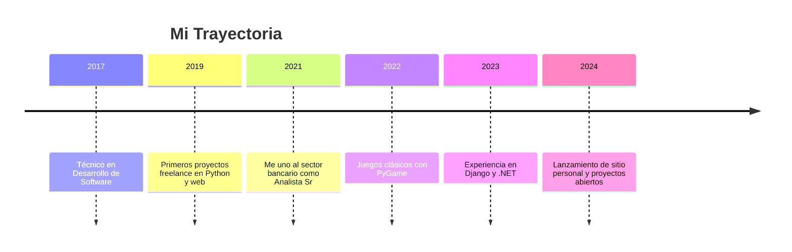
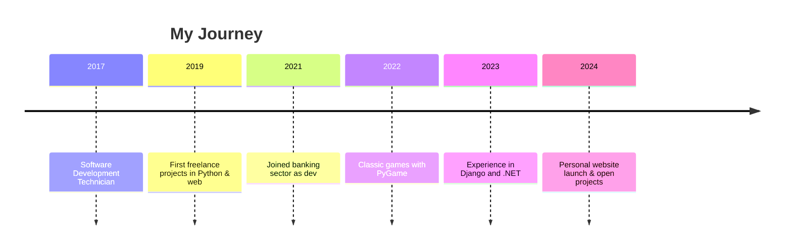

<!-- Banner animado con nombre y subtítulo centrados en blanco -->

  

<!-- Selector de idioma (banderas a la derecha) -->

  
  

---

## 🇦🇷 Español

### 📑 Tabla de Contenidos
- [Sobre mí](#sobre-mí)
- [Timeline](#timeline)
- [Tecnologías y herramientas](#tecnologías-y-herramientas)
- [Proyectos destacados](#proyectos-destacados)
- [Estadísticas y actividad](#estadísticas-y-actividad)
- [Actualmente aprendiendo](#actualmente-aprendiendo)
- [Contacto](#contacto)

---

### 👨‍💻 Sobre mí

- 💼 Técnico en Desarrollo de Software en un banco de Córdoba, Argentina.
- 🧑‍💻 Amante de la programación y el aprendizaje continuo.
- 🐍 Especializado en desarrollo web y de juegos con **Python** y sus frameworks.
- 🎮 Me divierte crear videojuegos clásicos con PyGame.
- 🌐 Más en [berisvilmauricio.ar](https://berisvilmauricio.ar).

---

### 🕓 Timeline

---

### 🛠️ Tecnologías y herramientas

  

---

### 🚀 Proyectos destacados

  <a href="https://github.com/MBerisvil/tu-juego1">
      
  </a>
   

---

### 📈 Estadísticas y actividad

  
  
  

---

### 🌱 Actualmente aprendiendo

- FastAPI & Docker
- Test Driven Development (TDD)
- Nuevos frameworks de Python
- Visualizaciones de datos avanzadas

---

### 📬 Contacto

  
  
  

---

## 🇬🇧 English

### 📑 Table of Contents
- [About me](#about-me)
- [Timeline](#timeline-1)
- [Technologies & Tools](#technologies--tools)
- [Featured Projects](#featured-projects)
- [Stats & Activity](#stats--activity)
- [Currently Learning](#currently-learning)
- [Contact](#contact-1)

---

### 👨‍💻 About me

- 💼 Software Development Technician at a bank in Córdoba, Argentina.
- 🧑‍💻 Passionate about coding and continuous learning.
- 🐍 Specialized in web and game development with **Python** and its frameworks.
- 🎮 Enjoys making classic games with PyGame.
- 🌐 More at [berisvilmauricio.ar](https://berisvilmauricio.ar).

---

### 🕓 Timeline

---

### 🛠️ Technologies & Tools

  

---

### 🚀 Featured Projects

  
  
  
  

  

---

### 📈 Stats & Activity

  
  
  

---

### 🌱 Currently Learning

- FastAPI & Docker
- Test Driven Development (TDD)
- New Python frameworks
- Advanced data visualization

---

### 📬 Contact

  
  
  

<!-- Proudly created with GPRM ( https://gprm.itsvg.in ) -->
